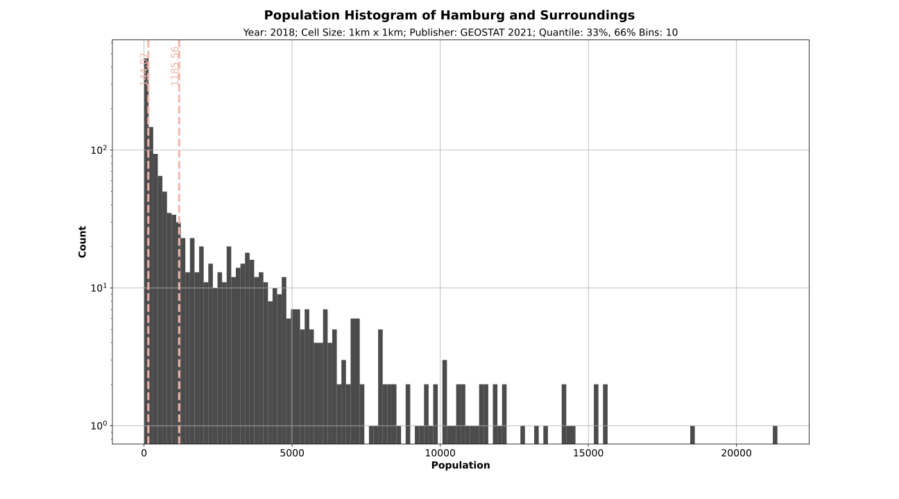
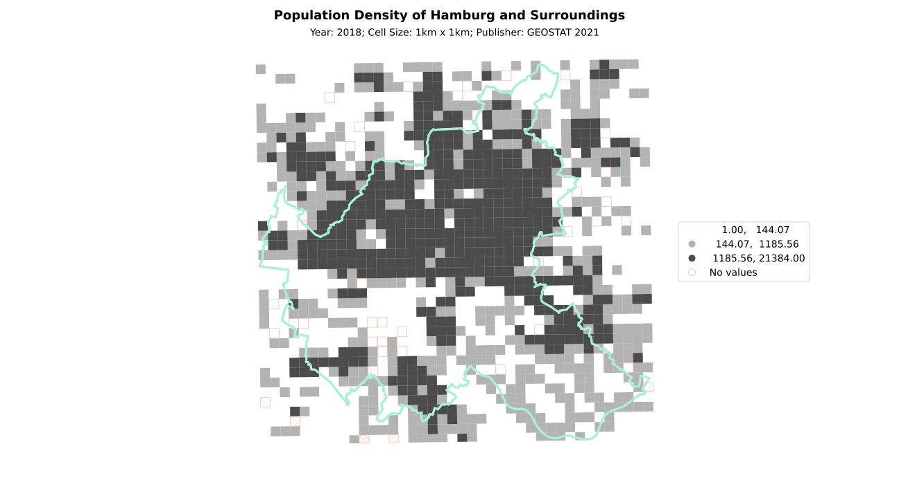
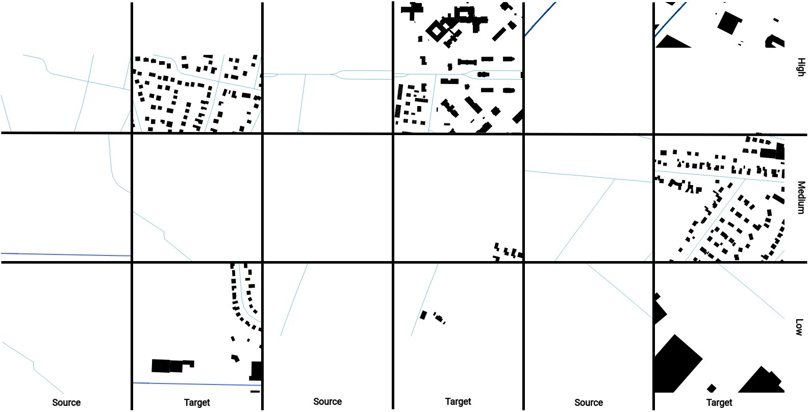

> Thoughts?
>
> just for a first writing and structuring in german
>
> citation -> maybe direct link & reference website with fixed entries??  
>
> citation with pages or without 
>
> Title image???? -> i have no idea how to select a good one :(
>
> genrellen theoretischen überbau erklären -> also warum quell und ziel daten etc. -> von grob zu klein

Um die Forschungsfrage zu beantworten wurden zwei unterschiedliche Ansätze zur Datenvorbereitung durchgeführt. Dabei zielen beide Ansätze darauf die bekannten Bedingungen und bekannte Inforamtionen aus dem orginalen GANmapper Artikel einzubeziehen. Der zweite und nicht getestete Versuch ist dabei eine Weiterentwicklung des ersten Ansatzes und übernimmt entsprechend weite Teile des ersten Ansatzes. Die Hintergründe wieso der zweite Ansatz in der Praxis nicht getestet werden konnte, wird in im [Diskussion](2023-07-07-discussion.md) genauer aufgezeigt. 

## Known requirements from the GANmapper paper
Wie bereits bekannt ist wurden innerhalb des Ganmapper Papers verschiedene Ansätze in Bezug auf die Daten und deren Konfiguration getestet. Wir verwenden hier nur deren beste Ergebnisse, um keine unnötigen Experiemente durchzuführen. Aus dem Paper können die geeigneten Einstellungen, wie folgt zusammengefasst werden:
* OpenStreetMap building and street data
* Coloured Road Hierarchy Diagrams (CRHD) proposed by Chen et al. (2021)
* NIcht alle Straßenzüge aus OSM wurden verwendet
* 256x256 resolution
* Zoom level 16 of the [Slippy map format](https://wiki.openstreetmap.org/wiki/Slippy_map)/XYZ-Tiles as a compromise between **XY** 
* **Addtional THINGS????**

## First approach
Zunächst wurden die OSM Daten von Hamburg, Niedersachsen und Schleswig-Holstein von der Website [www.geofabrik.de](https://download.geofabrik.de/) heruntergeladen und zusammengeführt. Im Anschluss wurden die Straßen und Gebäudegrundrisse auf die minimale Bounding Box der administrativen Grenzen von Hamburg zugeschnitten. Im eine Differenzierung nach Bevölkerungsdichten zu ermöglichen, wurden entsprechende Daten von [eurostat](https://ec.europa.eu/eurostat/web/gisco/geodata/reference-data/population-distribution-demography/geostat) heruntergeladen und zugeschnitten. Die Unterteilung nach Bevölkerungsdichten erfolgte durch eine Unterteilung in drei Quantile (<33%,>33%-<66%,>66%). Dies soll eine Unterteilung in niedrige, mittlere und hohe Bevölkerugnsdichte vereinfacht darstellen. Die entsprechende Verteilung inklusive der Grenzwerte können hier betrachtet werden: 

Histogram inklusive Quantile der Bevölkerungsdicht ein Hamburg und Umgebung in 2018

Nach Einteilung in drei Klassen inklusive des Untersuchungsgebietes folgt aus dieser Abbildung: 

Bounding Box und Bevölkerungsverteilung in Hamburg in Umgebung in 2018

Anschließend wurden die Straßen- und Gebäudedaten auf die jeweilige Bevölkerungsdichte zugeschnitten.
Bevor die XYZ-Tiles nun als Quell- und Zieldaten erzeugt werden konnten, mussten die Straßenzüge und Gebäude entsprechend der Vorgaben visualisiert werden. In Bezug auf die Gebäude wurden die Grundrisse einfach schwarz eingefärbt. Bei den Straßenzügen die als CRHD dargestellt werden, wurde auf das [GitHub Repository](https://github.com/ualsg/Road-Network-Classification/blob/main/crhd_generator.py) von Chen et al. (2021) zurückgegriffen. Hierzu musste die Annahme getroffen werden, dass die Autoren des GANmapper Papers exakt die entsprechenden Straßenzügen und Farben verwendet haben. In Bezug auf die Linienbreite wurden die Verhältnisse des Repository aufgegriffen und die Startbreite geschätzt. Im Anschluss konnten die Quell- und Zieldaten für die jeweilige Bevölkerungsdichte um XYZ-Format erzeugt werden. Einige Beispiele sehen so aus: 

Beispieltrainingdaten für den ersten Ansatz

Diese Datenpaare wurden im letzten Schritt mittels des existierenden Skriptes vorprozessiert. Wesentliche Schritte des Prozesses waren:
* Das aussortieren von Bildern ohne Gebäudegrundrisse
* Das aussortieren von Bildern mit wenigen Gebäudegrundrissen bzw. im Allgemeinen Bilder, wo weniger weiße Pixel inkludiert waren.
* Einteilen in einen Train, Test und Validierungssplit
* Kombination von der Quell- und Zieldaten zu einem größeren Bild

### Drawbacks of this approach 

* Limited amount of up-to-date population data with high spatial resolution
* removed blank tiles 
* nachteile wie weiße ränder 
* räumliche auflösung mit 1km*1km
* ES GEHT JA eigentlich um gebäude und nicht bevölkerungsdichte
* aussortierung im pre-processing scrupt welcher nirgends beschriebn ist 
* missing data
* kaum unterscheidung zwischen den klassen 

## Differences for the second approach
* Why did we actually should switch to this data
* small difference -> not everything again
* code
* histogram
* sample images
* slightly thicker lines -> effect unclear
* not differentiated between populationd density 
* more streets -> show errors + show graphics